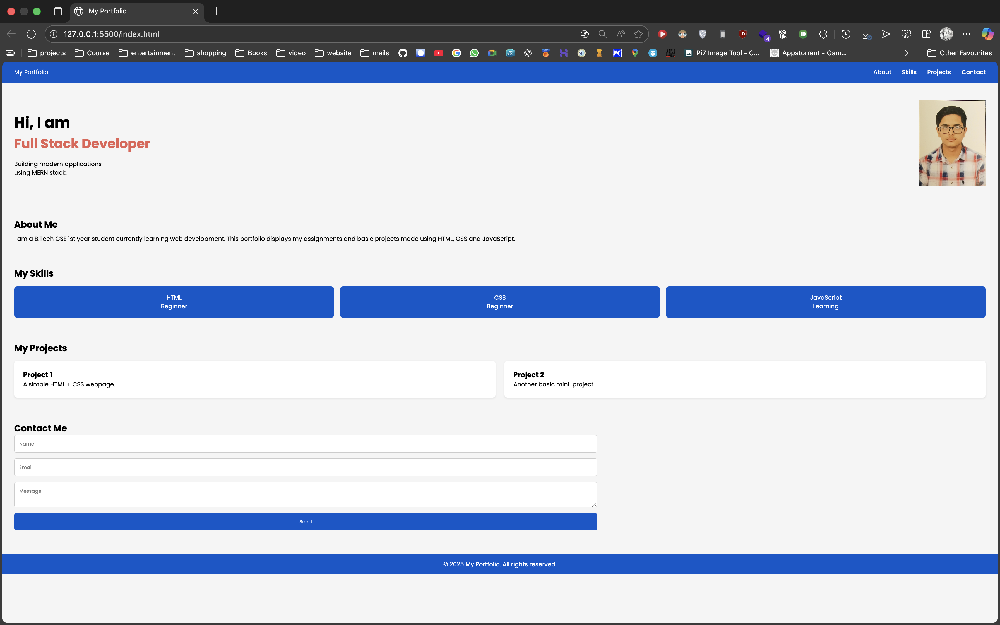

# web_dev-Assignment-03
Rahul(043)

# Lab Assignment 3 – Responsive Portfolio Website

## 📌 Description
This project is a single-page responsive portfolio website created using:
- Flexbox
- CSS Grid
- Media Queries
- CSS Animations & Transitions

It includes the required sections:  
Header, Hero, About, Skills, Projects, Contact, Footer.

## 📱 Responsive Behaviour
Breakpoints tested:
- 320px (mobile)
- 768px (tablet)
- 1024px+ (desktop)

## 🎯 Features Implemented
- Flexbox used in header & hero
- Grid used in skills and projects
- Hover effects on cards, links, buttons
- Keyframe animation (Full Stack Developer)
- Responsive across all devices
- Clean student-friendly code

## Output

